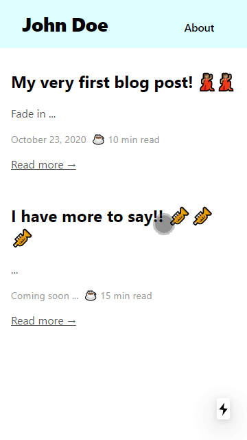

This is a [Next.js](https://nextjs.org/) project bootstrapped with [`create-next-app`](https://github.com/vercel/next.js/tree/canary/packages/create-next-app).

## Getting Started

First, run the development server:

```bash
npm run dev
# or
yarn dev
```

Open [http://localhost:3000](http://localhost:3000) with your browser to see the result.

You can start editing the page by modifying `pages/index.js`. The page auto-updates as you edit the file.

## Learn More

To learn more about Next.js, take a look at the following resources:

- [Next.js Documentation](https://nextjs.org/docs) - learn about Next.js features and API.
- [Learn Next.js](https://nextjs.org/learn) - an interactive Next.js tutorial.

You can check out [the Next.js GitHub repository](https://github.com/vercel/next.js/) - your feedback and contributions are welcome!

## Deploy on Vercel

The easiest way to deploy your Next.js app is to use the [Vercel Platform](https://vercel.com/import?utm_medium=default-template&filter=next.js&utm_source=create-next-app&utm_campaign=create-next-app-readme) from the creators of Next.js.

Check out our [Next.js deployment documentation](https://nextjs.org/docs/deployment) for more details.

## Demo



**Instructions for the initial setup**

Okay, so you're still here. So, here goes. You will need to follow the below steps to get what I have promised you. It is just 15 steps!

1. Create a new [GitHub](https://github.com/) account or log in using an existing account.
2. [Duplicate](https://docs.github.com/en/free-pro-team@latest/github/creating-cloning-and-archiving-repositories/duplicating-a-repository) the [blog-template](https://github.com/ryanivandsouza/blog-template) repository.
	- You can name the new copy appropriately
	- You should mark the forked copy as private
3. Create [Vercel](https://vercel.com/) account. You can sign up using your GitHub account.
4. Import your project into Vercel
	1. Click on **Import Project**
	2. Click **Continue** under *Import Git Repository*
	3. Copy the **URL** of the new git repository from Step #3 above and paste it in Vercel
	4. Click **Yes** to answer *Is this your personal GitHub account?*
	5. Select **Personal Account** to answer Select *Vercel account*
	6. Select **Only select repositories** and use the dropdown to select the newly created repository then click **Install**
	7. Click **Deploy** under *Import Project*
	8. Wait and watch until you Vercel *congratulates* you 🥳
	9. Click on **Visit** to verify deployment. It will open a dynamically generated link with an arbitrary name.
	10. Once done verification, you can return to the tab where Vercel was open and click on **Dashboard** to review the details.
	11. ***Note***: *This and the below steps are **optional** if you just want to try things out. **Also, This is the only place that you'd have to pay** *. Click on the **Settings** tab. Here you can click on **Domains** and enter your custom domain[^4] if you have bought one. Vercel will initially say Invalid Configuration and guide you to fix this.
	12. Now simply navigate to your URL with your custom domain and you should be able see and play with your very own website!
	 
<p align="center">
	<br />
	<br />
	
	<br />
	<br />
</p>

**Instructions for the local setup:**
1. Clone your new repository locally
2. Using your command terminal navigate into the folder where you cloned the repository and enter the below commands.
	i. `npm install`
	ii. `npm run dev`
3. This should start the server locally and you should be able to view the website locally in your browser on the same machine by going to http://localhost:3000
4. Now you can open the folder where you cloned the repository and edit the files in your favorite editor. Your changes should reflect automatically.
5. Feel free to make changes to the `pages\about\index.mdx`  file to change the **About page**.
6. You can add content under the `pages\blog` folder to add your blog posts

**Workflow to publish your changes** (*this assumes your have done steps 1-3 from the local setup above 👆🏽*)
1. Make changes. Let's change the name in the `pages\about\index.mdx` page.
2. Verify the changes locally on your browser by going to http://localhost:3000/about
3. Commit and push changes to GitHub
4. Wait for about 30 seconds. You're done!

If you find something that can be improved, or if something needs to be fixed. Feel free to raise issues in GitHub and I'll tend to it. Think of it as your contribution to open source.

I will work on updating the documentation [here](https://github.com/ryanivandsouza/blog-template/blob/main/README.md).

**What's the box made of?**

It is a simple [Next.js](https://nextjs.org/) in [GitHub](https://github.com/). [Vercel](https://vercel.com/) provides CI and hosting. The project has [MDX](https://mdxjs.com/) packages added to let you create content using Markdown.

**Other things you will need to do**

* Add metadata to change how your the preview for your website looks like[^5]
* Add analytics to help you with the information about user traffic on your website[^6]
* **IMPORTANT**: more than 80% of your readers will read your content on mobile phones. So make sure it fits right on smaller screens.

**What is not included?**
* Interactions with your readers on the article page via comments or likes. You can rely on Twitter, LinkedIn, Reddit or WhatsApp. The other option would be to enhance this setup to add a database and write more JavaScript to make your page more interactive.
* You will have to use the same channels as above to notify your readers about any new activity or new posts. if you don't want to get your hands dirty to host a RSS feed or a mail server

	Both of the above will be a one time thing.

[^1]:  [How To Build A Blog With Next And MDX by Ibrahima Ndaw](https://www.smashingmagazine.com/2020/09/build-blog-nextjs-mdx/)

[^2]:  I say text but you can use [Markdown](https://en.wikipedia.org/wiki/Markdown) and mix it up with plain ol' HTML or even add [React](https://reactjs.org/) because the pages are [MDX](https://mdxjs.com/)

[^3]: [Who Owns Your Content Online?](https://www.socialmediatoday.com/content/who-owns-your-content-online)

[^4]: You are free to buy your domain name from any of the available providers

[^5]: Go to https://metatags.io/ to get metadata tags for your website and go [here](https://ahrefs.com/blog/seo-meta-tags/) to learn about what they mean

[^6]: https://www.goatcounter.com/ is a good option for free and easy web analytics without tracking of personal data

[^7]: Refer to https://notion-blog.now.sh/, if you want to learn about deploying your website using Notion.

[^8]: GitHub and GitHub Desktop training video here: https://www.youtube.com/watch?v=C69-s2o9wqw
